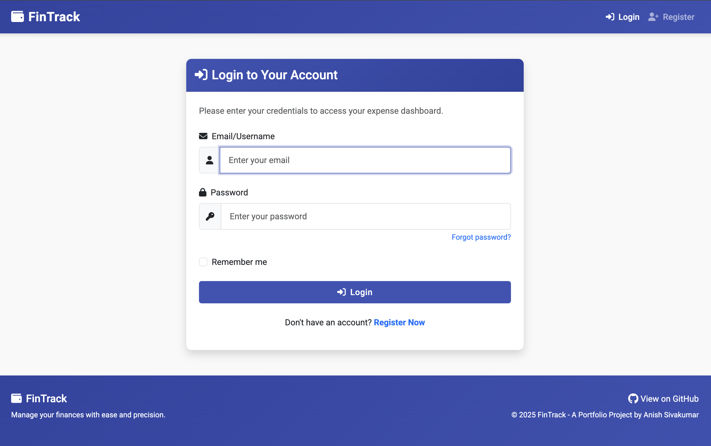
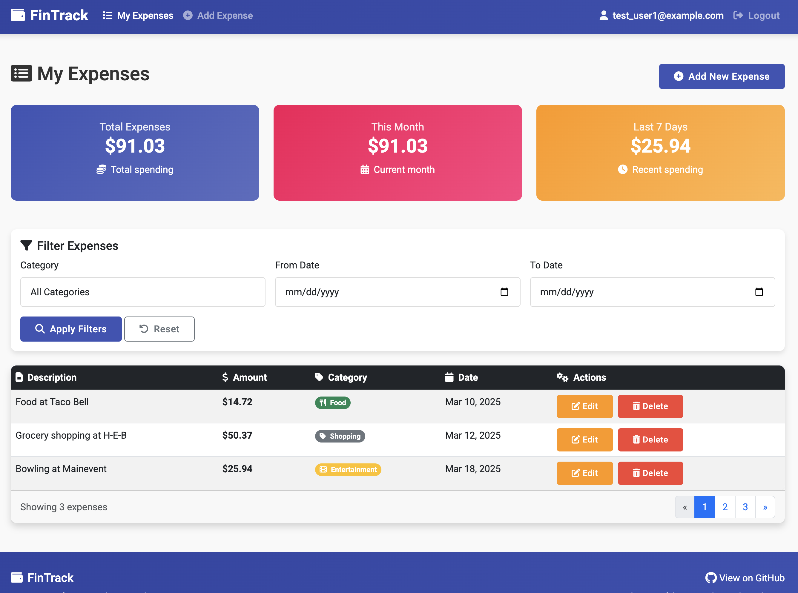
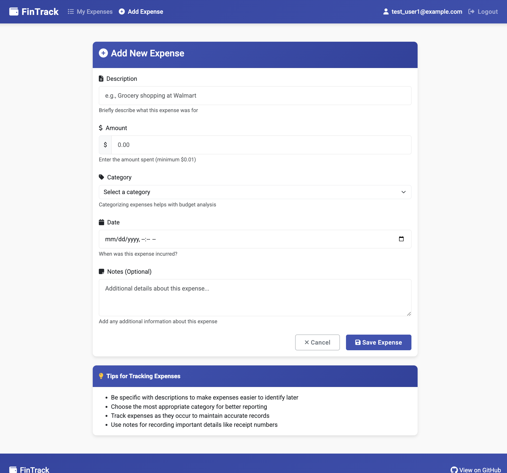

# FinTrack

A full-featured web application for tracking personal expenses built with Spring Boot.


## Features

- **User Authentication**
  - Secure registration and login
  - Password encryption
  - Role-based access control

- **Expense Management**
  - Add, view, edit, and delete expenses
  - Categorize expenses
  - Date-based organization
  - User-specific data isolation
  - Advanced filtering by category and date

- **User-Friendly Interface**
  - Responsive design using Bootstrap 5
  - Intuitive navigation with icons
  - Form validation
  - Interactive expense dashboard with expense summaries

## Technology Stack

### Backend
- **Java 17**
- **Spring Boot 3.x**
- **Spring Security** - Authentication and authorization
- **Spring Data JPA** - Data access layer
- **Hibernate** - ORM for database operations
- **MySQL** - Relational database

### Frontend
- **Thymeleaf** - Server-side Java template engine
- **Bootstrap 5** - CSS framework
- **HTML5 & CSS3**
- **JavaScript** - Client-side validation
- **Font Awesome** - Icon library

### Tools & Utilities
- **Maven** - Dependency management and build
- **Git** - Version control
- **Postman** - API testing

## Getting Started

### Prerequisites
- JDK 17+
- Maven 3.8+
- MySQL 8.0+

### Installation

1. **Clone the repository**
   ```bash
   git clone https://github.com/anish-siv/FinTrack.git
   cd fintrack
   ```

2. **Configure database**
   - Create MySQL database named `expense_tracker`
   - Copy the sample properties file and update with your credentials:
     ```bash
     cp src/main/resources/application.properties.sample src/main/resources/application.properties
     ```
   - Update database configuration in `src/main/resources/application.properties`:
     ```properties
     spring.datasource.username=your_username
     spring.datasource.password=your_password
     ```
   - For production environments, it's recommended to use environment variables instead:
     ```properties
     spring.datasource.username=${DB_USERNAME}
     spring.datasource.password=${DB_PASSWORD}
     ```
     And set these environment variables in your system or deployment platform.

3. **Build and run the application**
   ```bash
   mvn clean install
   mvn spring-boot:run
   ```

4. **Access the application**
   - Open a web browser and navigate to `http://localhost:8095`

## Usage

### Registration and Login
1. Navigate to the homepage
2. Click "Register" to create a new account
3. Log in with your credentials
4. You'll be automatically redirected to your expense dashboard

### Managing Expenses
1. View your expenses on the dashboard with total, monthly, and weekly summaries
2. Add new expenses using the "Add Expense" button
3. Filter expenses by category or date range
4. Edit or delete expenses using the action buttons

## Screenshots





## Project Structure

```
src/main/java/com/finance/expensetracker/
├── controller/     # HTTP request handlers
├── dto/            # Data Transfer Objects
├── model/          # Entity definitions
├── repository/     # Data access interfaces
├── security/       # Security configuration
└── service/        # Business logic implementation
```

## Future Enhancements

- Budget planning and tracking
- Expense analytics and reporting
- Email notifications
- Receipt image upload
- Multi-currency support
- Mobile app integration

## Contributing

Contributions are welcome! Please feel free to submit a Pull Request. See the [CONTRIBUTING.md](CONTRIBUTING.md) file for more details.

## License

This project is licensed under the MIT License - see the [LICENSE](LICENSE) file for details.

## Acknowledgments

- Spring Boot documentation
- Bootstrap documentation
- Stack Overflow community 
