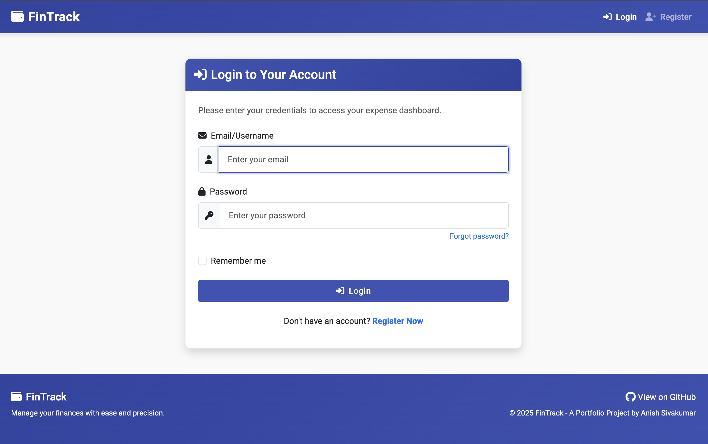
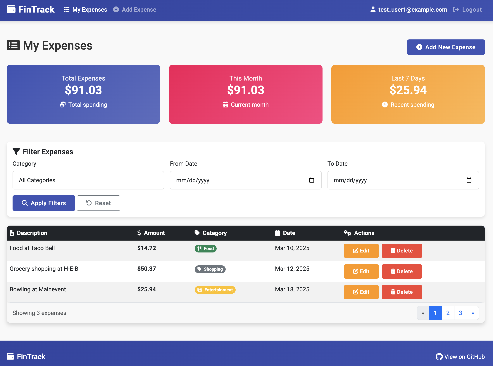
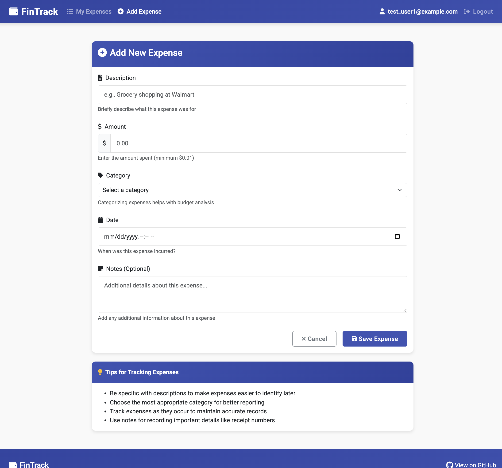

# FinTrack

A full-featured web application for tracking personal expenses built with Spring Boot.


## Features

- **User Authentication**
  - Secure registration and login
  - Password encryption with BCrypt
  - Session-based access control

- **Expense Management**
  - Add, view, edit, and delete expenses
  - Categorize expenses (Food, Transportation, Housing, Entertainment, Utilities, Healthcare, Shopping, Other)
  - Date-based organization
  - User-specific data isolation
  - Filter by category and date range

- **User-Friendly Interface**
  - Responsive design using Bootstrap 5
  - Intuitive navigation with icons
  - Server-side form validation
  - Expense dashboard with total, monthly, and weekly summaries

## Technology Stack

### Backend
- **Java 17**
- **Spring Boot 3.x**
- **Spring Security** - Authentication and authorization
- **Spring Data JPA** - Data access layer
- **Hibernate** - ORM for database operations
- **H2** - In-memory database (default, for development)
- **MySQL** - Relational database (optional, for persistent storage)

### Frontend
- **Thymeleaf** - Server-side Java template engine
- **Bootstrap 5** - CSS framework
- **HTML5 & CSS3**
- **Font Awesome** - Icon library

### Tools & Utilities
- **Maven** - Dependency management and build

## Getting Started

### Prerequisites
- JDK 17+
- Maven 3.8+

### Quick Start (H2 — No Database Setup Required)

1. **Clone the repository**
   ```bash
   git clone https://github.com/anish-siv/FinTrack.git
   cd FinTrack
   ```

2. **Build and run the application**
   ```bash
   mvn clean install
   mvn spring-boot:run
   ```

3. **Access the application**
   - Open a web browser and navigate to `http://localhost:8095`
   - H2 database console is available at `http://localhost:8095/h2-console` (JDBC URL: `jdbc:h2:mem:expense_tracker`, username: `sa`, no password)

> **Note:** The default H2 in-memory database requires no setup, but data is lost when the application restarts. For persistent storage, see the MySQL setup below.

### Optional: MySQL Setup (Persistent Storage)

1. **Install MySQL 8.0+**

2. **Create the database**
   ```sql
   CREATE DATABASE expense_tracker;
   ```

3. **Update the configuration**
   - Copy the MySQL sample properties file over the default:
     ```bash
     cp src/main/resources/application.properties.sample src/main/resources/application.properties
     ```
   - Edit `src/main/resources/application.properties` and replace the placeholder credentials:
     ```properties
     spring.datasource.username=your_username
     spring.datasource.password=your_password
     ```

4. **Build and run**
   ```bash
   mvn clean install
   mvn spring-boot:run
   ```

## Usage

### Registration and Login
1. Navigate to the homepage
2. Click "Get Started for Free" or "Register" in the navbar to create a new account
3. Log in with your credentials
4. You'll be automatically redirected to your expense dashboard

### Managing Expenses
1. View your expenses on the dashboard with total, monthly, and weekly summaries
2. Add new expenses using the "Add New Expense" button
3. Filter expenses by category or date range
4. Edit or delete expenses using the action buttons

## Screenshots





## Project Structure

```
src/main/java/com/finance/expensetracker/
├── controller/     # HTTP request handlers
├── dto/            # Data Transfer Objects
├── exception/      # Global exception handling
├── model/          # Entity definitions
├── repository/     # Data access interfaces
├── security/       # Security configuration
└── service/        # Business logic implementation
```

## Future Enhancements

- Budget planning and tracking
- Expense analytics and reporting
- Email notifications
- Receipt image upload
- Multi-currency support
- Mobile app integration

## Contributing

Contributions are welcome! Please feel free to submit a Pull Request. See the [CONTRIBUTING.md](CONTRIBUTING.md) file for more details.

## License

This project is licensed under the MIT License - see the [LICENSE](LICENSE) file for details.

## Acknowledgments

- Spring Boot documentation
- Bootstrap documentation
- Stack Overflow community
